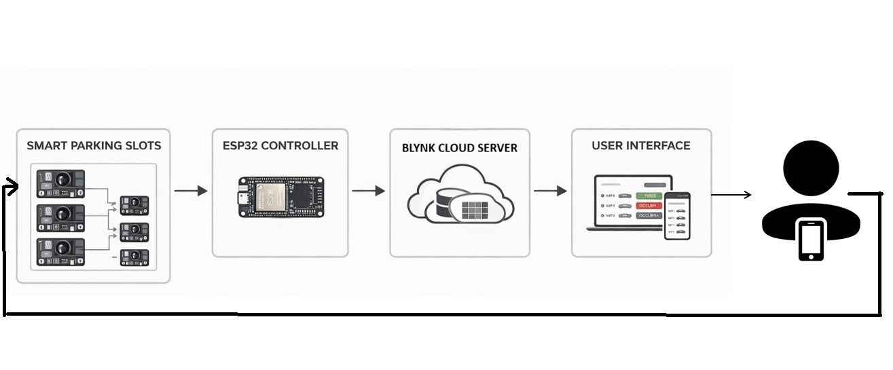
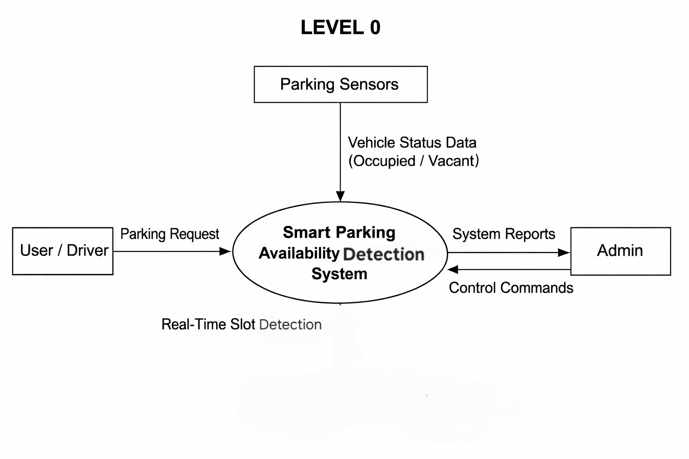
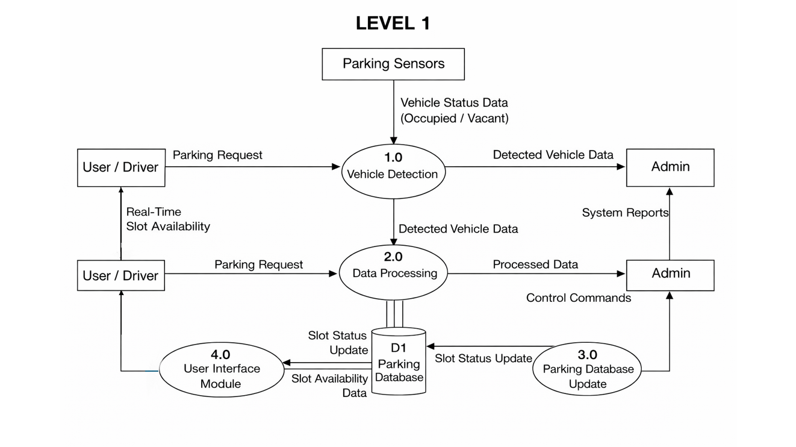
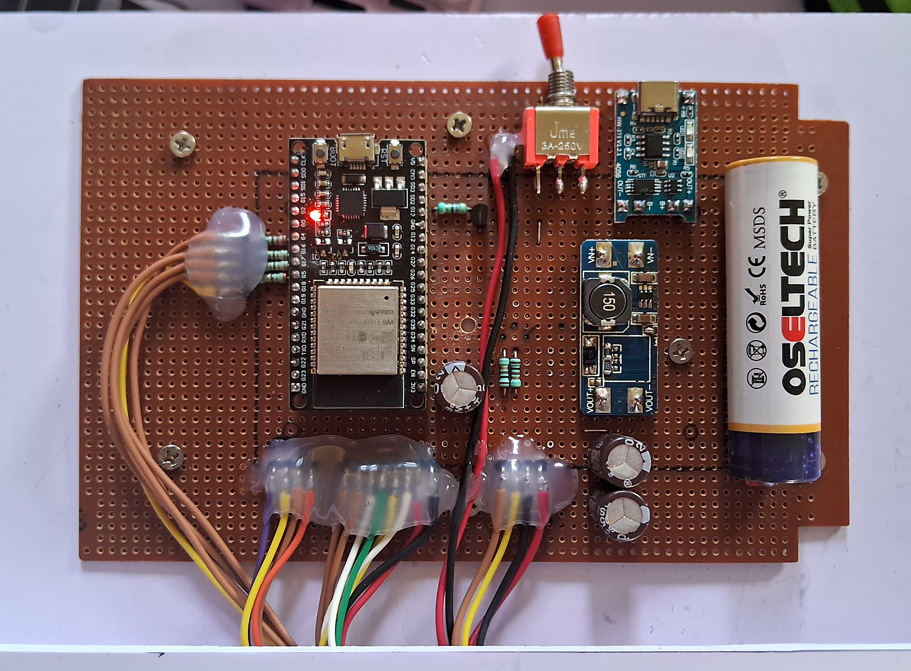
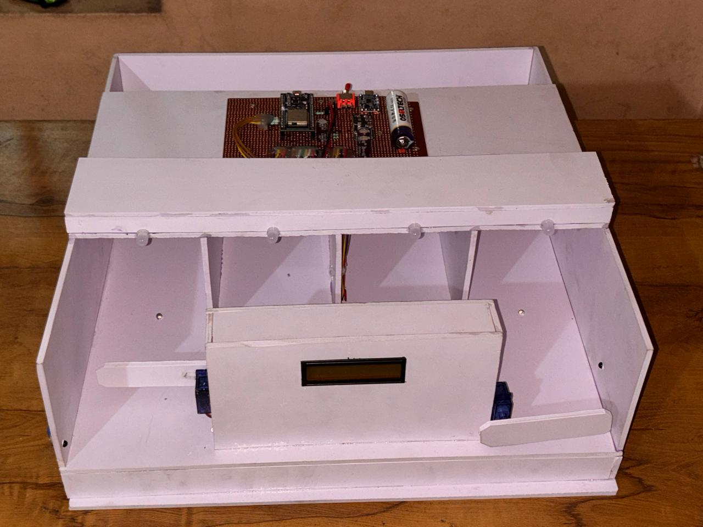
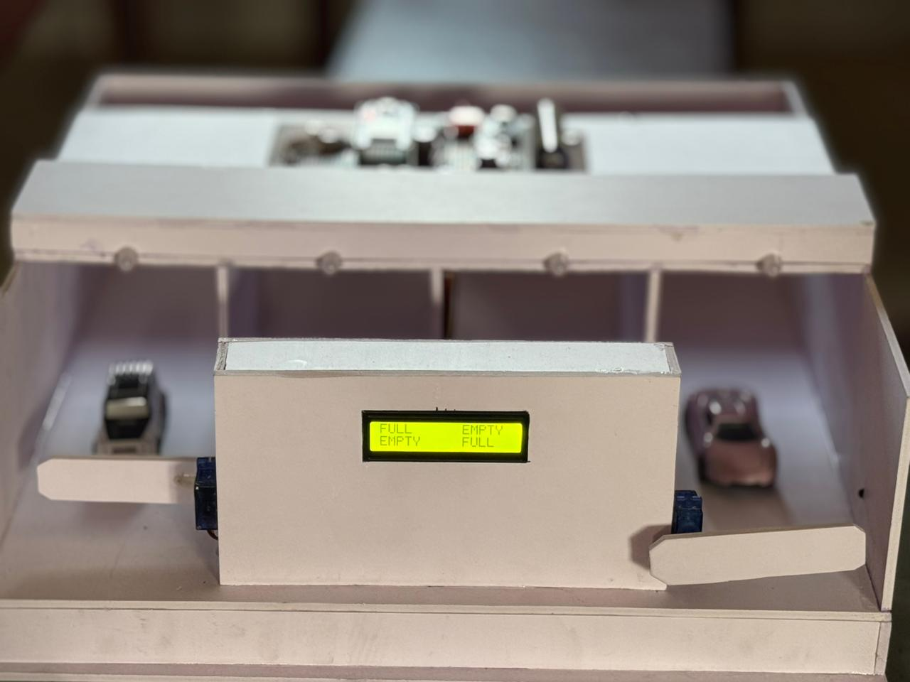
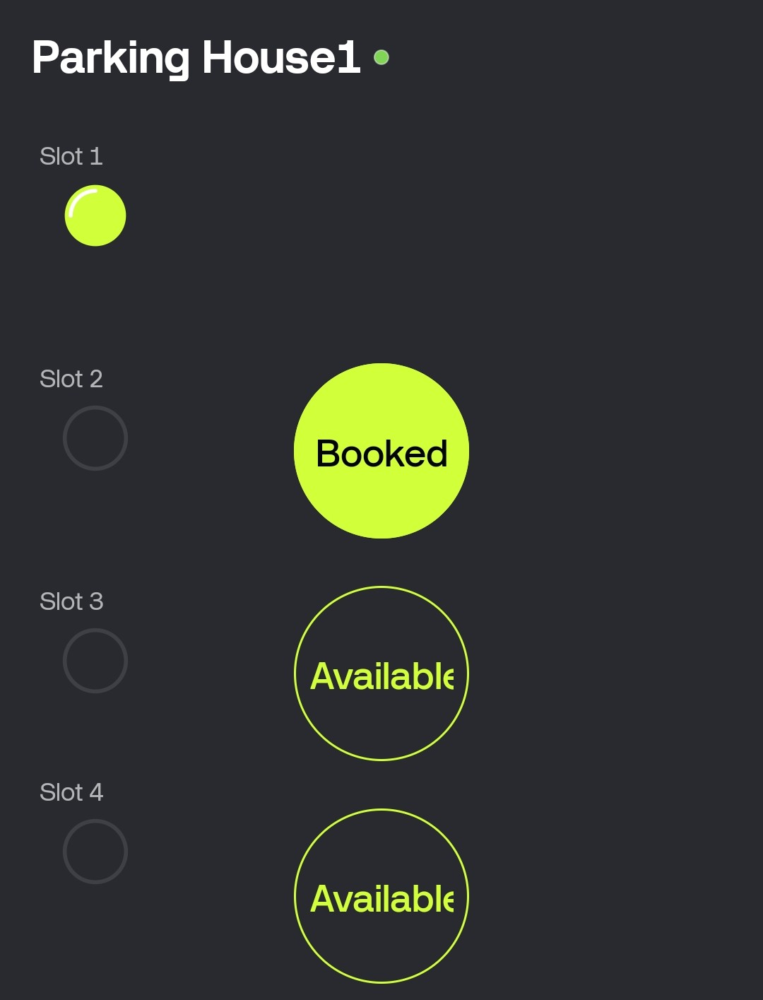

# Smart Parking Availability Monitoring System Using IoT

An IoT-based smart parking system that monitors parking slot availability in real time using ESP32, IR sensors, LCD, LEDs, servo motors, and Blynk IoT.

## Project Overview

The system detects the availability of four parking slots using IR sensors. The ESP32 processes the sensor data and displays the parking status on an LCD. The parking information is also sent to the Blynk IoT platform for remote monitoring and booking.

Servo motors are used to control the entry and exit gates, while LEDs indicate the status of individual parking slots.

## Features

- Real-time parking slot monitoring
- Four-slot parking availability detection
- IR-based vehicle detection
- LCD display for parking status
- LED indication for slot status
- Parking slot booking through Blynk
- Remote monitoring using Blynk IoT
- Automatic entry and exit gate control

## System Architecture



## Data Flow

### Level 0



### Level 1



## Hardware Setup



## Parking Model



### Parking Model with Vehicles



## Blynk Dashboard



## Technologies Used

- ESP32
- IR Sensors
- Arduino IDE
- Embedded C/C++
- Blynk IoT
- LCD Display
- LEDs
- Servo Motors
- Wi-Fi

## Project Structure

```text
smart-parking-iot/
├── images/
├── src/
│ └── smart_parking.ino
├── .gitignore
└── README.md
